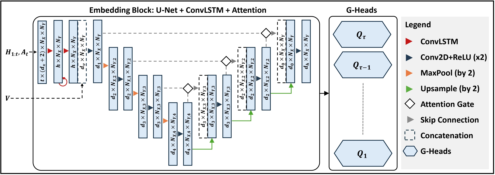

# GST-UNet: Spatiotemporal Causal Inference with Time-Varying Confounders

GST-UNet is a neural framework that combines a U-Net-based architecture with iterative G-computation to estimate causal effects in spatiotemporal settings, addressing interference, temporal carryover, and time-varying confounders for Conditional Average Potential Outcome (CAPO) estimation.



## Requirements

* [PyTorch](https://pytorch.org/)
* [GeoPandas](https://geopandas.org/)

## Replication Code for Paper

Use the following commands to replicate the figures from the "GST-UNet: Spatiotemporal Causal Inference with Time-Varying Confounders" paper:

* For Table 1: 

```
cd train && ./submit_jobs.sh
cd ../data/simulated_data && python summarize.py
```
This will produce the ```summary.csv``` file in ```data/simulated_data/linear```.
* For Figure 3:
```
cd train && python wildfire_experiment.py
```